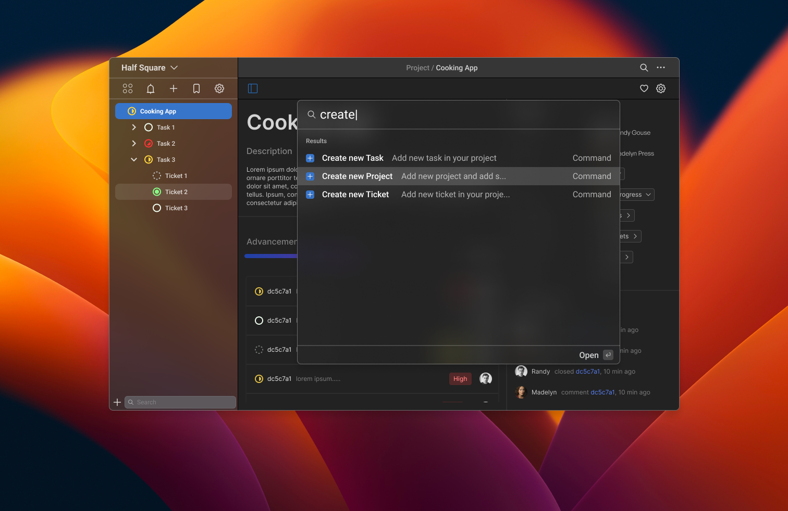

<a name="readme-top"></a>

<!-- PROJECT LOGO -->
<br />
<div align="center">
  <a href="https://github.com/Half-Square/Statch">
    
  </a>

  <h3 align="center">Statch</h3>

  <p align="center">
Welcome to the Statch Project Manager! This project is a project management tool built with Angular and Typescript for the front end, NodeJS, NestJS and Prisma for the back end, and SQLite for the database.
    <br />
    <a href="https://github.com/Half-Square/Statch/issues">Report Bug</a>
    ·
    <a href="https://github.com/Half-Square/Statch/issues">Request Feature</a>
  </p>
</div>


<!-- TABLE OF CONTENTS -->
<details>
  <summary>Table of Contents</summary>
  <ol>
    <li>
      <a href="#about-the-project">About The Project</a>
      <ul>
        <li><a href="#built-with">Built With</a></li>
      </ul>
    </li>
    <li>
      <a href="#getting-started">Getting Started</a>
      <ul>
        <li><a href="#prerequisites">Prerequisites</a></li>
        <li><a href="#installation">Installation</a></li>
      </ul>
    </li>
    <li><a href="#usage">Usage</a></li>
    <li><a href="#roadmap">Roadmap</a></li>
    <li><a href="#contributing">Contributing</a></li>
    <li><a href="#license">License</a></li>
    <li><a href="#contact">Contact</a></li>
  </ol>
</details>


<!-- ABOUT THE PROJECT -->
## About The Project

  <div align="center">
  <a href="https://github.com/Half-Square/Statch">
  
  </a>
  </div>

The Statch Project Manager is designed to help teams effectively manage their projects and tasks. It provides a range of features including the ability to create and manage projects, assign tasks to team members, track progress, collaborate in real-time, and monitor project performance and resource utilization.

<p align="right">(<a href="#readme-top">back to top</a>)</p>


### Built With

This section should list any major frameworks/libraries used to bootstrap your project. Leave any add-ons/plugins for the acknowledgements section. Here are a few examples.

* [Angular](https://angular.io/ "Angular") - A typescript framework, is a platform for building mobile and desktop web applications
* [Typescript](https://www.typescriptlang.org/ "Typescript") - A typed superset of JavaScript that compiles to plain JavaScript
* [NodeJS](https://nodejs.org/en/ "NodeJS") - A JavaScript runtime built on Chrome's V8 JavaScript engine
* [NestJS](https://nestjs.com/ "NestJS") - A progressive Node.js framework for building efficient, scalable, and enterprise-grade server-side applications
* [SQLite](https://www.sqlite.org/download.html "SQLite") - SQLite is a C-language library that implements a small, fast, self-contained, high-reliability, full-featured, SQL database engine.
* [Prisma](https://www.prisma.io/ "Prisma") - Prisma Client is a query builder that’s tailored to your schema. We designed its API to be intuitive, both for SQL veterans and developers brand new to databases.

<p align="right">(<a href="#readme-top">back to top</a>)</p>


<!-- GETTING STARTED -->
## Getting Started

### Prerequisites

To get started with the Statch, you'll need to have the following software installed on your machine:

* [NodeJS 18.12.1](https://nodejs.org/en/download/releases/ "NodeJS")
* [SQLite](https://www.sqlite.org/download.html "SQLite")
* [Prisma CLI 4.9.0](https://www.prisma.io/ "Prisma")
* [NestJS CLI 9.1.9](https://nestjs.com/ "NestJS") 

### Installation

1. Clone the repo

   ```sh
   git clone https://github.com/Half-Square/Statch.git
   ```
   
2. Install the dependencies

   ```sh
    npm run setup
   ```

3. To install for development purpose

   ```
    npm run setup:dev
   ```
   
### Run project

1. Start the front end development server

  ```sh
  npm run start:client
  ```
   
2. Start the back end server

  ```sh
  npm run start:server
  ```


### Build project

1. Build server

  ```sh
  npm run build:full
  ```
   
<p align="right">(<a href="#readme-top">back to top</a>)</p>


<!-- USAGE EXAMPLES -->
## Usage

To use the Statch Project Manager, follow these steps:

1. Create a new project by clicking the "New Project" button in the top right corner of the dashboard.
2. Add tasks to the project by clicking the "Add Task" button on the project page.
3. Assign tasks to team members by clicking the "Assign" button on the task card.
4. Monitor progress by viewing the task list on the project page.
5. Collaborate with team members in real-time using the in-app comment feature.

<p align="right">(<a href="#readme-top">back to top</a>)</p>


<!-- ROADMAP
## Roadmap

We have a number of features planned for future releases of the Statch Project Manager. These include:
- [ ] Add Changelog
- [ ] Mobile app for iOS and Android
- [ ] Monitor project performance and resource utilization using the various graphs and charts available on the dashboard.
- [ ] Multi-language Support
    - [ ] French

See the [open issues](https://github.com/Half-Square/Statch/issues) for a full list of proposed features (and known issues).

<p align="right">(<a href="#readme-top">back to top</a>)</p>
-->


<!-- CONTRIBUTING -->
## Contributing

Contributions are what make the open source community such an amazing place to learn, inspire, and create. Any contributions you make are **greatly appreciated**.

If you have a suggestion that would make this better, please fork the repo and create a pull request. You can also simply open an issue with the tag "enhancement".
Don't forget to give the project a star! Thanks again!

1. Fork the Project
2. Create your Feature Branch (`git checkout -b feature/AmazingFeature`)
3. Commit your Changes (`git commit -m 'Add some AmazingFeature'`)
4. Push to the Branch (`git push origin feature/AmazingFeature`)
5. Open a Pull Request

<p align="right">(<a href="#readme-top">back to top</a>)</p>


<!-- LICENSE -->
## License

Distributed under the MIT License. See `LICENSE` for more information.

<p align="right">(<a href="#readme-top">back to top</a>)</p>


<!-- CONTACT -->
## Contact

Half Square - [Website](https://halfsquare.fr "Half Square's website") or [contact@halfsquare.fr](mailto:contact@halfsquare.fr "contact@halfsquare.fr")

Project Link: [https://github.com/Half-Square/Statch](https://github.com/Half-Square/Statch)

<p align="right">(<a href="#readme-top">back to top</a>)</p>
